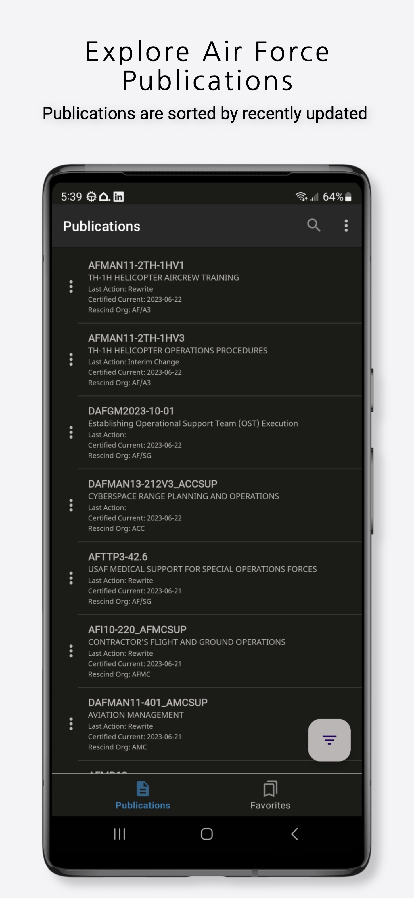
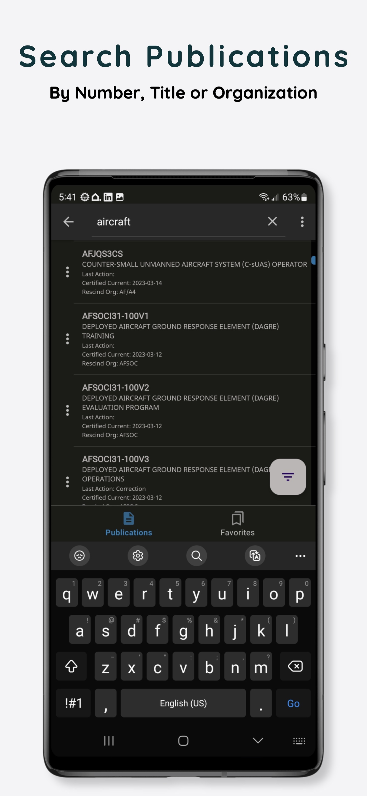
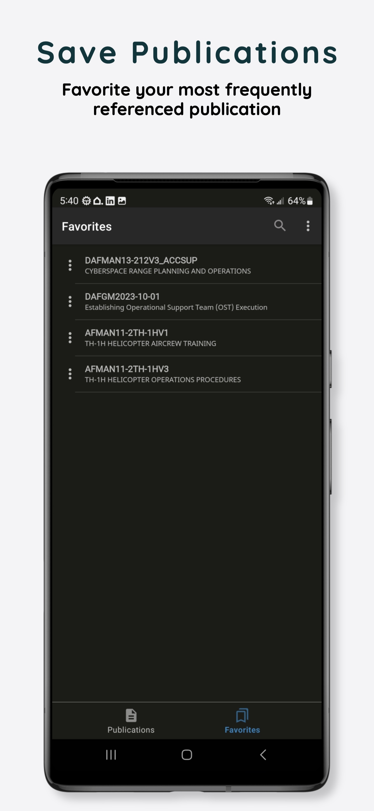
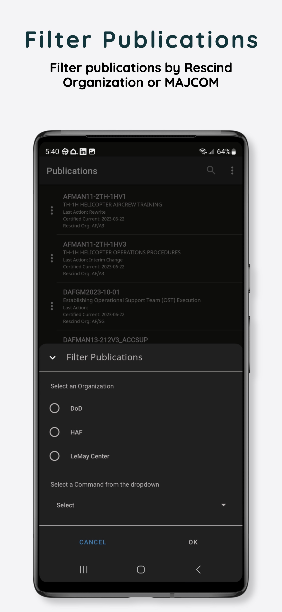
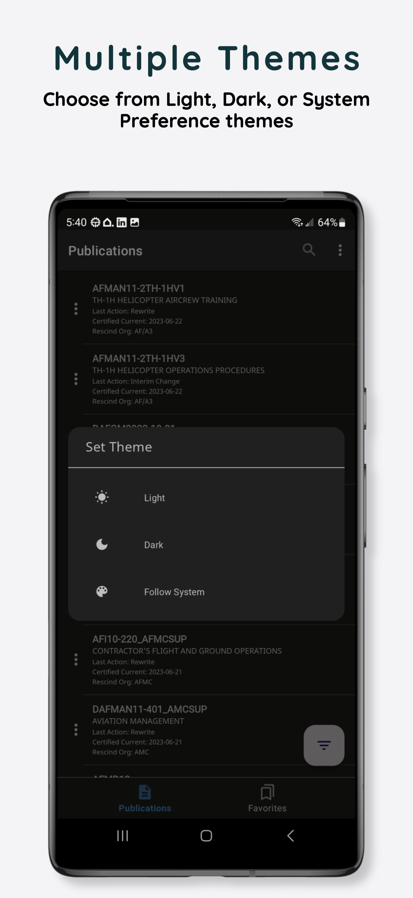

<!-- PROJECT LOGO -->
<br />
<div align="center">
  <a href="https://github.com/drewstephensdesigns/AFIExplorer">
    
  </a>
<br />
    <a href='https://play.google.com/store/apps/details?id=io.github.drewstephenscoding.afiexplorer'>
      
  </a>
  <br />
  <a href="https://www.buymeacoffee.com/drewcodesit" target="_blank"></a>

<h2 align="center">AFI Explorer (Android)</h2>

<!-- PROJECT SHIELDS -->
<!--
*** I'm using markdown "reference style" links for readability.
*** Reference links are enclosed in brackets [ ] instead of parentheses ( ).
*** See the bottom of this document for the declaration of the reference variables
*** for contributors-url, forks-url, etc. This is an optional, concise syntax you may use.
*** https://www.markdownguide.org/basic-syntax/#reference-style-links
-->

  [![Issues][issues-shield]][issues-url]
  [![MIT License][license-shield]][license-url]
  [![LinkedIn][linkedin-shield]][linkedin-url]

  <p align="center">
    Quickly reference and search the contents of Air Force publications right on your mobile device. <br />All publications sync directly with e-publishing.af.mil
    <br />
     <a href="https://afiexplorer.com"><strong>Explore the docs »</strong></a>
    <br />
    <br />
     <a href="https://github.com/drewstephensdesigns/AFIExplorer/issues">Report Bug</a>
    ·
     <a href="https://github.com/drewstephensdesigns/AFIExplorer/issues">Request Feature</a>
    <br />
    <a href="https://github.com/drewstephensdesigns/AFIExplorer/blob/a35fcbcc52eeb488c80aed56598502ad45016266/CHANGE_LOG.md">Change Log</a>
  ·
    <a href="https://github.com/drewstephensdesigns/AFIExplorer/tags">Releases</a>
  </p>
</div>

<h4 align="center">App Demo</h4>
<div align="center"; style="width:100%; display:flex; justify-content:space-between;">

</div>


<!-- TABLE OF CONTENTS -->
<details>
  <summary>Table of Contents</summary>
  <ol>
    <li>
      <a href="#about-the-project">About The Project</a>
      <ul>
        <li><a href="#built-with">Built With</a></li>
      </ul>
    </li>
    <li>
      <a href="#getting-started">Getting Started</a>
      <ul>
        <li><a href="#prerequisites">Prerequisites</a></li>
        <li><a href="#installation">Installation</a></li>
      </ul>
    </li>
    <li><a href="#roadmap">Roadmap</a></li>
    <li><a href="#contributing">Contribute</a></li>
    <li><a href="#license">License</a></li>
    <li><a href="#contact">Contact</a></li>
    <li><a href="#acknowledgments">Acknowledgments</a></li>
  </ol>
</details>


<!-- ABOUT THE PROJECT -->
## About The Project
<!--
[![Product Name Screen Shot][product-screenshot]](https://afiexplorer.com)
-->

This app was born out of necessity and started as a proof of concept by two U.S Air Force personnel.  Built with Modern Android development tools, this app allows you to quickly search, save and download Air Force and select Department of Defense guidance and publications.  We're always looking to improve the app and graciously take feedback.  Please use the email at the bottom of the page, or in app feedback link to reach out.  You can also open an issue for review!

<h3 align="center">Screenshots</h3>
<div align="center"; style="width:100%; display:flex; justify-content:space-between;">

  []()
  []()
  []()
  []()
  []()

</div>

### Built With 🛠
- [Kotlin](https://kotlinlang.org/) - First class and official programming language for Android development.
- [Coroutines](https://kotlinlang.org/docs/reference/coroutines-overview.html) - For asynchronous and more..
- [Toasty](https://github.com/GrenderG/Toasty) - The usual Toast, but with steroids
- [Sheets](https://github.com/maxkeppeler/sheets) - Sleek dialogs and bottom-sheets for quick use in your app
- [LottieFiles](https://github.com/airbnb/lottie-android) - Lottie is a mobile library for Android and iOS that parses Adobe After Effects animations exported as json with Bodymovin and renders them natively on mobile!
- [Android Architecture Components](https://developer.android.com/topic/libraries/architecture) - Collection of libraries that help you design robust, testable, and maintainable apps.
  - [LiveData](https://developer.android.com/topic/libraries/architecture/livedata) - Data objects that notify views when the underlying database changes.
  - [Room](https://developer.android.com/topic/libraries/architecture/room) - SQLite object mapping library.
- [Material Components for Android](https://github.com/material-components/material-components-android) - Modular and customizable Material Design UI components for Android.


## Permissions 🔒
The following permissions are utilized in the app, nothing more.
```
    <uses-permission android:name="android.permission.INTERNET" />
    <uses-permission android:name="android.permission.ACCESS_WIFI_STATE" />
    <uses-permission android:name="android.permission.READ_EXTERNAL_STORAGE" />
    <uses-permission android:name="android.permission.WRITE_EXTERNAL_STORAGE" />
```
- android.permission.INTERNET is required for network operations 
- android.permission.ACCESS_WIFI_STATE allows applications to access information about Wi-Fi networks
- android.permission.READ_EXTERNAL_STORAGE allows an application to read from external storage.
- android.permission.WRITE_EXTERNAL_STORAGE allows an application to write to external storage.

Additional information for these permissions can be found at https://developer.android.com/reference/android/Manifest.permission

<!-- GETTING STARTED -->
## Getting Started

This project uses the Gradle build system. To build this project, use the `gradlew build` command or use "Import Project" in Android Studio.

To run tests, run `gradlew test`

### Prerequisites
To learn more about Android accessibility, visit the Android accessibility page. 
To learn more about developer facing aspects of Android accessibility, read the accessibility developer guide.

### Installation

1. Get the Base API at [https://api.afiexplorer.com](https://api.afiexplorer.com)
2. Get the Air National Guard API at [https://drewstephensdesigns.github.io/ANGPublications/data.json](https://drewstephensdesigns.github.io/ANGPublications/data.json)
3. Clone the repo
   ```sh
   git clone https://github.com/drewstephensdesigns/AFIExplorer.git
   ```

<!-- ROADMAP -->
## Roadmap
<!--
- [ ] Feature 1
- [ ] Feature 2
- [ ] Feature 3
    - [ ] Nested Feature
-->
See the [Suggestions](https://github.com/drewstephensdesigns/AFIExplorer/blob/master/SUGGESTIONS.md) for a full list of proposed features (and known issues).

<!-- Contribute -->
## Contributing
Contributions are what make the open source community such an amazing place to learn, inspire, and create. Any contributions you make are **greatly appreciated**.

If you have a suggestion that would make this better, please fork the repo and create a pull request. You can also simply open an issue with the tag "enhancement".
Don't forget to give the project a star! Thanks again! See the guide at [Contributing](https://github.com/drewstephensdesigns/AFIExplorer/blob/master/CONTRIBUTING.md)

1. Fork the Project
2. Create your Feature Branch (`git checkout -b feature/AmazingFeature`)
3. Commit your Changes (`git commit -m 'Add some AmazingFeature'`)
4. Push to the Branch (`git push origin feature/AmazingFeature`)
5. Open a Pull Request

<h2 align="left">
<sub>

</sub>
Donate
</h2>

Donations can be made at:
* The sponsor icon at the top of the page or at https://www.buymeacoffee.com/drewcodesit

<!-- LICENSE -->
## License

Distributed under the MIT License. See [`LICENSE.md`](https://github.com/drewstephensdesigns/AFIExplorer/blob/a35fcbcc52eeb488c80aed56598502ad45016266/LICENSE.md) for more information.

<!-- CONTACT -->
## Contact

Drew - drewstephensdesigns@gmail.com

Project Link: [https://github.com/DrewStephensCoding/AFIExplorer](https://github.com/drewstephensdesigns/AFIExplorer)

<!-- ACKNOWLEDGMENTS -->
## Acknowledgments

* [r/AirForce](https://www.reddit.com/r/AirForce/)
* [HAF/A4L Tesseract](https://www.tesseract.af.mil)

> **Optimism is the faith that leads to achievement. Nothing can be done without hope and confidence** <br>
> Helen Keller

<div align="right">
  <table><td>
    <a href="#start-of-content">↥ Scroll to top</a>
  </td></table>
</div>

[product-screenshot]: screenshots/AFI%20Explorer.png
[issues-shield]: https://img.shields.io/github/issues/drewstephensdesigns/AFIExplorer.svg?style=for-the-badge
[issues-url]: https://github.com/drewstephensdesigns/AFIExplorer/issues
[license-shield]: https://img.shields.io/github/license/drewstephensdesigns/AFIExplorer.svg?style=for-the-badge
[license-url]: https://github.com/drewstephensdesigns/AFIExplorer/blob/master/LICENSE.md
[linkedin-shield]: https://img.shields.io/badge/-LinkedIn-black.svg?style=for-the-badge&logo=linkedin&colorB=555
[linkedin-url]: https://www.linkedin.com/in/drewstephens/
